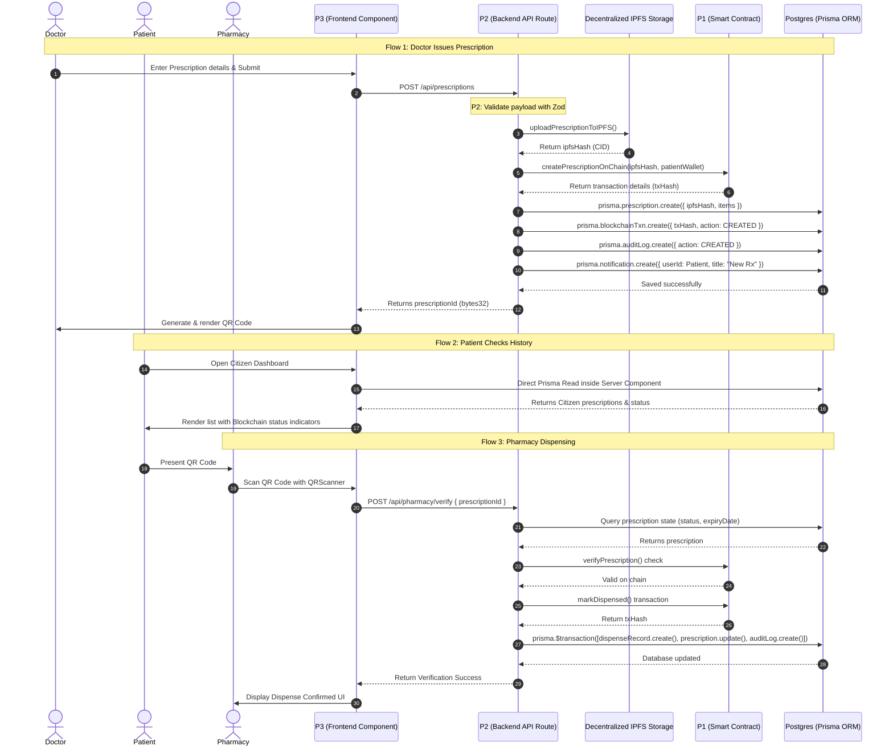

# MediChain — Team Database Integration Guide

> **For**: P1 (Blockchain), P2 (Backend), P3 (Frontend)  
> **From**: Database/Prisma Engineer  
> **Status**: Database is LIVE on Prisma Postgres cloud ✅
> **Workspace Path**: `c:/Users/vkram/OneDrive/Desktop/Medichain/Medichain`

---

## 1. What's Ready For You (Database Layer)

The database schema, Prisma client singleton, migrations, and seed data have been set up and tested successfully:

```
prisma/schema.prisma       ← 8 models, 4 enums, all relations + indexes
prisma/seed.ts             ← Demo data seeded (4 users, 1 prescription, items, audit log)
prisma.config.ts           ← Config with seed command
lib/prisma.ts              ← Singleton client — IMPORT THIS on server-side
generated/prisma/          ← Auto-generated Prisma client types (do not edit)
app/api/health/route.ts    ← Health check API route (Prisma usage example)
app/api/users/route.ts     ← Example showing user queries and filters
```

---

## 2. Quick Start — Using Prisma in the Codebase

### Step 1: Import the Client
In any server-side file (API routes `/app/api/**`, Server Components, or background scripts), import the singleton client:
```typescript
import { prisma } from "@/lib/prisma";
```

> [!WARNING]
> **Never import `@/lib/prisma` in client components** (`'use client'` files). Client components run in the browser and cannot access the database directly. Client components must fetch data from Next.js API routes.

### Step 2: Query Patterns
```typescript
// 1. Read multiple records
const users = await prisma.user.findMany();

// 2. Read single record with relationships
const prescription = await prisma.prescription.findUnique({
  where: { prescriptionId: "0xabc..." },
  include: {
    items: true,
    doctor: true,
    patient: true,
  }
});

// 3. Create a record with nested relations (atomic write)
const newRx = await prisma.prescription.create({
  data: {
    prescriptionId: "0xblockchain_hash...",
    doctorId: "doctor-user-id",
    patientId: "patient-user-id",
    ipfsHash: "QmPinataHash...",
    expiryDate: new Date("2026-12-31"),
    items: {
      create: [
        { medicineName: "Paracetamol", dosage: "500mg", duration: "5 days", quantity: 10 }
      ]
    }
  }
});
```

---

## 3. Database Schema Blueprint

```
┌──────────────┐     1:N     ┌────────────────┐     1:N     ┌───────────────────┐
│    User      │────────────▶│  Prescription  │────────────▶│ PrescriptionItem  │
│              │  (doctor)   │                │             │                   │
│ id (cuid)    │────────────▶│ id (cuid)      │             │ id (cuid)         │
│ name         │  (patient)  │ prescriptionId │             │ prescriptionId    │
│ email (unique│             │ doctorId (FK)  │             │ medicineName      │
│ role (Enum)  │             │ patientId (FK) │             │ dosage            │
│ walletAddress│             │ ipfsHash       │             │ duration          │
│ digilockerId │             │ status (Enum)  │             │ quantity          │
│ abhaId       │             │ expiryDate     │             │ instructions      │
│ createdAt    │             │ createdAt      │             └───────────────────┘
│ updatedAt    │             │ updatedAt      │
└──────┬───────┘             └───────┬────────┘
       │                             │
       │ 1:N                         │ 1:1
       ▼                             ▼
┌──────────────┐             ┌────────────────┐     1:1     ┌───────────────────┐
│  AuditLog    │             │ DispenseRecord │────────────▶│  BlockchainTxn    │
│              │             │                │             │                   │
│ id (cuid)    │             │ id (cuid)      │             │ id (cuid)         │
│ userId (FK)  │             │ prescriptionId │             │ txHash (unique)   │
│ role (Enum)  │             │ pharmacyId(FK) │             │ blockNumber       │
│ action       │             │ dispensedAt    │             │ action (Enum)     │
│ entityId     │             │ txHash         │             │ walletAddress     │
│ txHash       │             │ status (Enum)  │             │ timestamp         │
│ timestamp    │             │ remarks        │             │ network           │
│              │             └────────────────┘             │ dispenseRecordId  │
└──────────────┘                                            └───────────────────┘
┌──────────────┐             ┌────────────────┐
│MedicineBatch │             │  Notification  │
│              │             │                │
│ id (cuid)    │             │ id (cuid)      │
│ medicineName │             │ userId (FK)    │
│ batchNumber  │             │ title          │
│ manufacturer │             │ message        │
│ expiryDate   │             │ isRead         │
│ ipfsHash     │             │ createdAt      │
└──────────────┘             └────────────────┘

Enums:
  Role               → CITIZEN | DOCTOR | PHARMACY | REGULATOR
  PrescriptionStatus → CREATED | VERIFIED | DISPENSED | EXPIRED
  DispenseStatus     → PENDING | COMPLETED | REJECTED
  BlockchainAction   → PRESCRIPTION_CREATED | PRESCRIPTION_VERIFIED | PRESCRIPTION_DISPENSED | BATCH_REGISTERED
```

---

## 4. How Each Team Member Integrates

```
                           ┌───────────────────────────┐
                           │   Next.js App (Client)    │
                           └─────────────┬─────────────┘
                                         │
                                   HTTP requests
                                         │
                                         ▼
                           ┌───────────────────────────┐
                           │   Next.js App (Server)    │
                           └─────┬───────────────┬─────┘
                                 │               │
                            Prisma ORM     ethers / Pinata
                                 │               │
                                 ▼               ▼
                       ┌───────────┐   ┌───────────────────┐
                       │PostgreSQL │   │Blockchain & IPFS  │
                       └───────────┘   └───────────────────┘
```

---

### 4.1 P1 — Blockchain Engineer Guide

**Goal**: Deploy contracts to Polygon Amoy testnet, write `lib/blockchain.ts`, and link on-chain state transitions back to PostgreSQL via Prisma.

#### 1. Contract Events Mapping
Your contracts should emit events which will be indexed or recorded:
- **`PrescriptionCreated(bytes32 indexed prescriptionId, address doctor, address patient, bytes32 ipfsHash)`**
- **`PrescriptionDispensed(bytes32 indexed prescriptionId, address pharmacy)`**
- **`BatchRegistered(string batchId, string medicineName, address manufacturer)`**

#### 2. Writing Transactions to DB
When a transaction is successfully sent and mined, create a corresponding `BlockchainTxn` entry to index it:

```typescript
// lib/blockchain.ts
import { prisma } from "@/lib/prisma";
import { BlockchainAction } from "@prisma/client";

export async function recordTransaction(params: {
  txHash: string;
  blockNumber: number;
  action: BlockchainAction;
  walletAddress: string;
  dispenseRecordId?: string;
}) {
  return await prisma.blockchainTxn.create({
    data: {
      txHash: params.txHash,
      blockNumber: params.blockNumber,
      action: params.action,
      walletAddress: params.walletAddress,
      network: "polygon-amoy",
      dispenseRecordId: params.dispenseRecordId
    }
  });
}
```

#### 3. Smart Contract Read Helper (`hooks/useContract.ts`)
Provide hooks for the frontend (P3) to read contract states in real time:
```typescript
// hooks/useContract.ts
import { useState, useEffect } from "react";
import { ethers } from "ethers";
import PrescriptionABI from "../../contracts/artifacts/contracts/PrescriptionContract.sol/PrescriptionContract.json";

const CONTRACT_ADDRESS = process.env.NEXT_PUBLIC_PRESCRIPTION_CONTRACT_ADDRESS!;

export function usePrescriptionStatusOnChain(prescriptionIdBytes32: string) {
  const [status, setStatus] = useState<number | null>(null);
  const [loading, setLoading] = useState(true);

  useEffect(() => {
    async function fetchStatus() {
      if (!window.ethereum) return;
      try {
        const provider = new ethers.BrowserProvider(window.ethereum);
        const contract = new ethers.Contract(CONTRACT_ADDRESS, PrescriptionABI.abi, provider);
        const data = await contract.getPrescription(prescriptionIdBytes32);
        setStatus(Number(data.status)); // 0=CREATED, 1=VERIFIED, 2=DISPENSED
      } catch (err) {
        console.error("Failed to query blockchain:", err);
      } finally {
        setLoading(false);
      }
    }
    fetchStatus();
  }, [prescriptionIdBytes32]);

  return { status, loading };
}
```

---

### 4.2 P2 — Backend & Database Engineer Guide

**Goal**: Coordinate NextAuth for security, upload metadata to IPFS via Pinata SDK, build API routes, validate request payloads, and use transactions.

#### 1. IPFS Pinata Integration (`lib/ipfs.ts`)
Write helper functions to upload JSON metadata documents to Pinata:

```typescript
// lib/ipfs.ts
import pinataSDK from "@pinata/sdk";
import { PrescriptionMetadata } from "@/types";

const pinata = new pinataSDK(
  process.env.PINATA_API_KEY!,
  process.env.PINATA_SECRET_API_KEY!
);

export async function uploadPrescriptionToIPFS(
  metadata: PrescriptionMetadata,
  prescriptionId: string
) {
  try {
    const response = await pinata.pinJSONToIPFS(metadata, {
      pinataMetadata: { name: `prescription-${prescriptionId}` }
    });
    return {
      cid: response.IpfsHash,
      url: `${process.env.PINATA_GATEWAY}/ipfs/${response.IpfsHash}`,
      size: Number(response.PinSize)
    };
  } catch (error) {
    console.error("IPFS Upload Failed:", error);
    throw new Error("Failed to store metadata on IPFS");
  }
}
```

#### 2. Real DigiLocker OAuth & User Sync (`app/api/auth/digilocker/route.ts`)
During login, retrieve the user info from DigiLocker API and upsert the record in Prisma:
```typescript
// app/api/auth/digilocker/route.ts
import { NextRequest, NextResponse } from "next/server";
import { prisma } from "@/lib/prisma";

export async function GET(req: NextRequest) {
  const code = req.nextUrl.searchParams.get("code");
  if (!code) return NextResponse.json({ error: "Missing authorization code" }, { status: 400 });

  try {
    // 1. Exchange OAuth code for access token
    const tokenResponse = await fetch("https://api.digilocker.gov.in/public/oauth2/1/token", {
      method: "POST",
      headers: { "Content-Type": "application/x-www-form-urlencoded" },
      body: new URLSearchParams({
        code,
        client_id: process.env.DIGILOCKER_CLIENT_ID!,
        client_secret: process.env.DIGILOCKER_CLIENT_SECRET!,
        redirect_uri: process.env.DIGILOCKER_REDIRECT_URI!,
        grant_type: "authorization_code",
      })
    });
    const tokens = await tokenResponse.json();

    // 2. Fetch User Profile
    const profileResponse = await fetch("https://api.digilocker.gov.in/public/oauth2/1/user", {
      headers: { Authorization: `Bearer ${tokens.access_token}` }
    });
    const profile = await profileResponse.json(); // contains digilockerid, name, abhaId etc

    // 3. Sync/Upsert User in Database
    const user = await prisma.user.upsert({
      where: { digilockerId: profile.digilockerid },
      update: { name: profile.name, abhaId: profile.abha_id },
      create: {
        digilockerId: profile.digilockerid,
        name: profile.name,
        email: profile.email || `${profile.digilockerid}@digilocker.demo`,
        role: "CITIZEN", // default role, Gov Regulator updates doctor/pharmacy roles
        abhaId: profile.abha_id
      }
    });

    return NextResponse.redirect(new URL("/dashboard", req.url));
  } catch (err) {
    return NextResponse.json({ error: "DigiLocker Auth failed" }, { status: 500 });
  }
}
```

#### 3. Zod Payload Validations (`lib/validations/prescription.ts`)
Always validate fields on the backend before running db commands:
```typescript
import { z } from "zod";

export const createPrescriptionSchema = z.object({
  patientId: z.string().cuid(),
  expiryDate: z.string().datetime(),
  medicines: z.array(
    z.object({
      name: z.string().min(1, "Medicine name required"),
      dosage: z.string().min(1, "Dosage details required"),
      duration: z.string().min(1, "Duration required"),
      quantity: z.number().int().positive(),
      instructions: z.string().optional()
    })
  ).min(1, "At least one medicine required")
});
```

---

### 4.3 P3 — Frontend Engineer Guide

**Goal**: Access database data securely through Next.js Server Components, consume APIs in Client Components, and handle role-based dashboard widgets.

#### 1. Direct Prisma Reading inside Server Components (Zero API Overhead)
If a page doesn't require client interaction (like displaying a history table), query the database directly in the Next.js Page component:

```typescript
// app/dashboard/citizen/page.tsx
import { prisma } from "@/lib/prisma";
import { getServerSession } from "next-auth";
import { authOptions } from "@/lib/auth";
import { redirect } from "next/navigation";

export default async function CitizenDashboard() {
  const session = await getServerSession(authOptions);
  if (!session || session.user.role !== "CITIZEN") redirect("/login");

  // Query database directly
  const prescriptions = await prisma.prescription.findMany({
    where: { patientId: session.user.id },
    include: { items: true, doctor: { select: { name: true } } },
    orderBy: { createdAt: "desc" }
  });

  return (
    <div className="p-6">
      <h1 className="text-2xl font-bold mb-4">My Prescriptions ({prescriptions.length})</h1>
      <div className="grid gap-4">
        {prescriptions.map((rx) => (
          <div key={rx.id} className="border p-4 rounded shadow-sm bg-card">
            <h3 className="font-semibold">Dr. {rx.doctor.name}</h3>
            <p className="text-sm text-muted-foreground">Expires: {new Date(rx.expiryDate).toLocaleDateString()}</p>
            <div className="mt-2 text-sm">
              {rx.items.map((item) => (
                <div key={item.id}>{item.medicineName} — {item.dosage} ({item.quantity} qty)</div>
              ))}
            </div>
          </div>
        ))}
      </div>
    </div>
  );
}
```

#### 2. Triggering Mutations from Client Components
Use standard fetches to standard API routes to submit data:
```typescript
"use client";

import { useState } from "react";

export function CreatePrescriptionButton({ payload }: { payload: any }) {
  const [loading, setLoading] = useState(false);

  const handleSubmit = async () => {
    setLoading(true);
    try {
      const res = await fetch("/api/prescriptions", {
        method: "POST",
        headers: { "Content-Type": "application/json" },
        body: JSON.stringify(payload)
      });
      const data = await res.json();
      if (data.success) {
        alert("Prescription Created!");
      } else {
        alert("Error: " + data.error);
      }
    } catch (e) {
      console.error(e);
    } finally {
      setLoading(false);
    }
  };

  return (
    <button onClick={handleSubmit} disabled={loading} className="bg-primary text-white p-2 rounded">
      {loading ? "Creating..." : "Issue Prescription"}
    </button>
  );
}
```

---

## 5. Robust Blockchain-to-DB Sync (Event Listener Daemon)

Instead of relying solely on the client's API request to save transactions, the team can implement an event indexer daemon. This runs in the background of Next.js or a separate runner, subscribing to contract events and reconciling database records to prevent inconsistencies.

```typescript
// lib/blockchain-indexer.ts
import { ethers } from "ethers";
import { prisma } from "@/lib/prisma";
import PrescriptionABI from "../contracts/artifacts/contracts/PrescriptionContract.sol/PrescriptionContract.json";

const CONTRACT_ADDRESS = process.env.NEXT_PUBLIC_PRESCRIPTION_CONTRACT_ADDRESS!;
const RPC_WS = process.env.NEXT_PUBLIC_POLYGON_WS_RPC!; // WebSocket provider for real-time subs

export function startBlockchainListener() {
  console.log("Starting MediChain Event Indexer...");
  const provider = new ethers.WebSocketProvider(RPC_WS);
  const contract = new ethers.Contract(CONTRACT_ADDRESS, PrescriptionABI.abi, provider);

  // 1. Listen for on-chain creations
  contract.on("PrescriptionCreated", async (prescriptionId, doctorAddress, patientAddress, ipfsHash, event) => {
    console.log(`Contract Event: PrescriptionCreated detected! ID: ${prescriptionId}`);
    
    const txHash = event.log.transactionHash;
    const blockNumber = event.log.blockNumber;

    try {
      // Reconcile off-chain DB
      await prisma.$transaction(async (tx) => {
        // Find if this record was already created by the API optimistically
        const existing = await tx.prescription.findUnique({
          where: { prescriptionId }
        });

        if (existing) {
          // Update the transaction hash if it was missing
          await tx.prescription.update({
            where: { prescriptionId },
            data: { status: "CREATED" }
          });
        }

        // Add transaction log
        await tx.blockchainTxn.upsert({
          where: { txHash },
          update: { blockNumber },
          create: {
            txHash,
            blockNumber,
            action: "PRESCRIPTION_CREATED",
            walletAddress: doctorAddress,
          }
        });
      });
    } catch (err) {
      console.error("Failed to index event to Database:", err);
    }
  });

  // 2. Listen for on-chain dispensing
  contract.on("PrescriptionDispensed", async (prescriptionId, pharmacyAddress, event) => {
    console.log(`Contract Event: PrescriptionDispensed detected! ID: ${prescriptionId}`);
    
    const txHash = event.log.transactionHash;

    try {
      await prisma.$transaction(async (tx) => {
        // Find local prescription
        const rx = await tx.prescription.findUnique({ where: { prescriptionId } });
        if (rx) {
          await tx.prescription.update({
            where: { id: rx.id },
            data: { status: "DISPENSED" }
          });
          
          await tx.dispenseRecord.upsert({
            where: { prescriptionId: rx.id },
            update: { status: "COMPLETED", txHash },
            create: {
              prescriptionId: rx.id,
              pharmacyId: "system-recorded", // or map pharmacyAddress to User id
              status: "COMPLETED",
              txHash
            }
          });
        }
      });
    } catch (err) {
      console.error("Failed to index dispense event:", err);
    }
  });
}
```

---

## 6. End-to-End Execution Sequence Flow

The following sequence details what happens across all 3 team members' modules:



---

## 7. Summary Checklist for Success

- [x] **Database Connectivity**: Ready for all API requests. Connection settings are in `.env`.
- [ ] **P1 (Blockchain)**:
  - Deploy contracts to Polygon Amoy.
  - Set `NEXT_PUBLIC_PRESCRIPTION_CONTRACT_ADDRESS` and others in `.env.local`.
  - Compile contracts and put artifacts in folder paths where `lib/blockchain.ts` can import them.
- [ ] **P2 (Backend)**:
  - Setup NextAuth using the secret keys.
  - Implement Pinata API keys in environment config.
  - Create the API endpoints using the example templates in `/app/api/**`.
- [ ] **P3 (Frontend)**:
  - Design user dashboards using layout shells.
  - Call API routes on data mutation.
  - Query DB directly inside Server Components to speed up page loads.

---

*Handoff document complete. Good luck, Team! 🚀*
